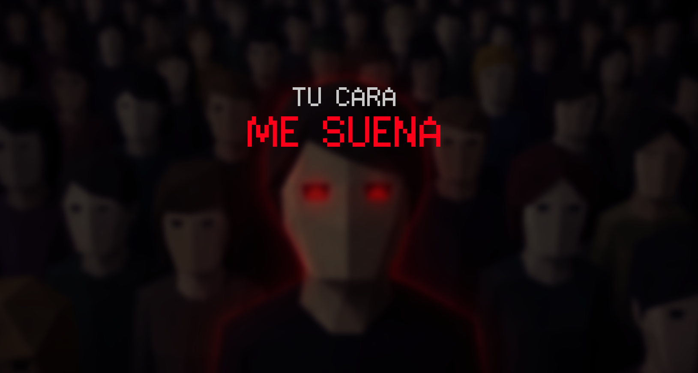

# Tu Cara Me Suena 

Juego multijugador 3D en primera persona desarrollado como **Trabajo Práctico Integrador**
de la materia **Programación Concurrente**. 


## 🎯 Finalidad

El objetivo del juego es implementar y demostrar
mecanismos de concurrencia funcionando de forma coordinada:

| Concepto de la materia | Cómo se demuestra en el juego |
|------------------------|-------------------------------|
| **Comunicación entre procesos** | Varias instancias del juego (en distintas PCs o ventanas) se comunican por red mediante RPC |
| **Hilos (threads)** | El movimiento de los clones se calcula en un hilo separado, sin bloquear el bucle principal del juego |
| **Exclusión mutua (mutex)** | El acceso a las posiciones compartidas de los clones se protege con un `Mutex` para evitar condiciones de carrera |

---

## 🕹️ Descripción del juego

En una batalla *todos contra todos*, los jugadores deben eliminarse entre sí, siendo el último en pie el ganador. Para ello, cada jugador debe poder identificar al resto de jugadores,  *camuflados entre la multitud de clones*, para poder eliminarlos.
Pero hay un problema: *todos los jugadores tienen exactamente la misma apariencia* -son los únicos clones idénticos entre sí en todo el mapa- y están mezclados en una multitud de NPCs (non-playable-character), por lo que hay que agudizar la vista para detectar los *accesorios* característicos de los jugadores.


### Reglas
- De **2 a 4 jugadores** por partida.
- Gana el jugador que gane la ronda.

### Controles
| Acción | Tecla |
|--------|-------|
| Moverse | `W` `A` `S` `D` |
| Mirar | Mouse |
| Correr | `Shift` |
| Cazar | Clic izquierdo |

---

## 🧩 Arquitectura del software

El juego usa un modelo **cliente-servidor** donde uno de los jugadores actúa como servidor
(*host-player*): no se necesita un servidor dedicado ni infraestructura externa.

```
        ┌──────────┐
        │ SERVIDOR │  (un jugador hace de host)
        │  (host)  │  · Valida las eliminaciones
        └────┬─────┘  · Maneja rondas y puntajes
       ┌─────┼─────┐  · Ejecuta el hilo de NPCs
       │     │     │
   ┌───┴─┐ ┌─┴───┐ ┌─┴───┐
   │ C-A │ │ C-B │ │ C-C │   clientes
   └─────┘ └─────┘ └─────┘
```

El código se organiza en diferentes módulos y escenas:

| Componente | Responsabilidad |
|------------|-----------------|
| `GameNetwork` | Conexiones de red, lista de jugadores y sincronización (RPC) |
| `Game` | Estado de la partida: jugadores restantes, eliminaciones (servidor autoritativo) |
| `NPCThreadPool` | Movimiento de los clones mediante **Thread Pool** |
| `NPC`| Aspecto y funcionalidades de los clones |
| `Player`| Funcionalidades del Jugador y la interacción con el usuario |
| `Map` | Mapa de la partida |
| `CharacterAppearence` | Define el aspecto que tendrán los jugadores y los clones |

---

## 💻 Tecnologías utilizadas

| Aspecto | Detalle |
|---------|---------|
| **Motor / Framework** | [Godot Engine 4.x](https://godotengine.org/) (versión 4.6 o superior) |
| **Lenguaje** | GDScript (lenguaje nativo de Godot) |
| **Red** | API de multiplayer de alto nivel de Godot — `ENetMultiplayerPeer` (protocolo ENet sobre UDP) |
| **Concurrencia** | `Pool de Threads`, `Mutex` y `Semáforo` de Godot; RPC para comunicación entre procesos |
| **Gráficos** | Assets 3D custom y de uso libre |

---

## ⚙️ Requisitos

### Software
- **Godot Engine 4.6** ([descarga oficial](https://godotengine.org/download)).
  No requiere instalación de dependencias adicionales: Godot es un único ejecutable.

### Sistema operativo
El proyecto es **multiplataforma** (Godot exporta a todos estos sistemas):

| Sistema operativo | Versión mínima recomendada |
|-------------------|----------------------------|
| **Windows** | Windows 10 / 11 (64 bits) |
| **Linux** | Distribución reciente de 64 bits (Ubuntu 20.04+ o equivalente) |
| **macOS** | macOS 10.15 (Catalina) o superior |

> Desarrollado y probado principalmente en **Windows 11**.

### Hardware
Los requisitos son **bajos**, ya que el juego usa geometría simple:

| Recurso | Mínimo |
|---------|--------|
| **CPU** | Procesador de doble núcleo (el hilo de NPCs aprovecha un segundo núcleo) |
| **RAM** | 4 GB |
| **GPU** | Tarjeta gráfica compatible con **OpenGL 3.3 / Vulkan** (la mayoría desde ~2012) |
| **Red** | Conexión LAN entre los jugadores |
| **Almacenamiento** | < 100 MB |

---

## 🚀 Cómo ejecutar

1. Instalar **Godot 4.6+**.
2. Abrir el proyecto: `Godot → Importar →` seleccionar el archivo `project.godot`.
3. Ejecutar con **F5**.
4. En una ventana, hacer clic en **"Crear partida"**; en las otras, **"Unirse"** con la IP
   del host (en local: `127.0.0.1`).
